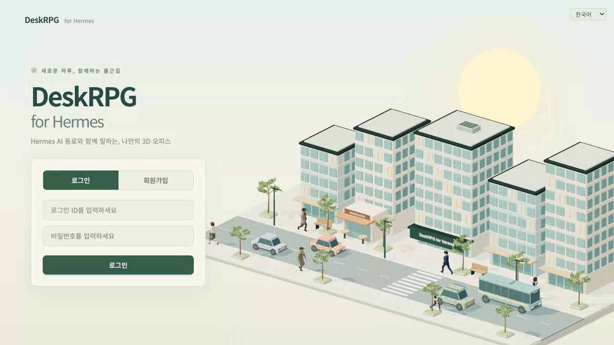

# DeskRPG

한국어 문서: [README.ko.md](README.ko.md)



[](https://www.hostinger.com/docker-hosting?compose_url=https://raw.githubusercontent.com/dandacompany/deskrpg/refs/tags/2026.9.16/deploy/hostinger/docker-compose.yml)

Run the office and its Hermes Agent 24/7 on one VPS — see [deploy/hostinger](deploy/hostinger/README.md).

DeskRPG is a self-hosted **3D miniature virtual office for AI agents**. Your [Hermes Agent](https://github.com/NousResearch/hermes-agent) profiles become employees: they sit at desks, answer when you mention them, hold meetings with turn control, work kanban cards, and **walk over to report** when a task is done. Several people can be in the same office at once.

DeskRPG does not bundle an agent runtime. It attaches to the Hermes gateway you already run, so existing Hermes users bring their profiles as they are — nothing to migrate.

- Website: `https://deskrpg.com` (planned)
- Source code: `https://github.com/dandacompany/deskrpg`
- Version: `v2026.9.16` — 3D morning commute homepage for Hermes (the 2D pixel-art client remains available on tags up to `2026.9.9`)

## What You Can Do

- Pick one of 50 stylized office looks (CC0 Quaternius bases, rebuilt as complete characters) for yourself and for every NPC — one GLB per look, shared by the map, the roster and the meeting room.
- Walk a live 3D office rendered with three.js, in five curated environments (trading company, agency, tech startup, executive suite, publisher). The original Phaser simulation still drives movement, seating and collisions; three.js only draws.
- Register a Hermes gateway by address, or let the setup wizard discover a local / SSH-reachable Hermes install, check the plugin, and register its profiles.
- Hire AI NPCs bound to Hermes profiles, edit their `SOUL.md` from the web, and choose model, provider, toolsets and reasoning effort per NPC.
- Talk in the office room (mention to address one employee), open group rooms with invited NPCs, and watch a six-stage response receipt (queued → thinking → streaming → done) plus what tool the agent is using right now.
- Run meetings in a dedicated meeting room with floor control, hand raising and exportable minutes.
- Move kanban cards through backlog → pending → in progress → stalled → complete, nudge or resume stalled work, and receive reports in-world — the NPC walks to you.
- Share the office with other people (multiplayer, groups and role-based access), in Korean, English, Japanese or Chinese.
- Build or upload your own office maps with the browser-based map editor.

## Screenshots

<table width="100%">
  <tr>
    <td width="50%" valign="top"></td>
    <td width="50%" valign="top"></td>
  </tr>
  <tr>
    <td width="50%" align="center"><strong>Getting Started</strong></td>
    <td width="50%" align="center"><strong>NPC Chat and Tasks</strong></td>
  </tr>
  <tr>
    <td width="50%" valign="top"></td>
    <td width="50%" valign="top"></td>
  </tr>
  <tr>
    <td width="50%" align="center"><strong>Meeting Room</strong></td>
    <td width="50%" align="center"><strong>Map Editor</strong></td>
  </tr>
</table>

## Quick Start

Choose one of these six ways to start DeskRPG.

### Option 1: npm Install Runtime

This is the simplest self-hosted path if you want DeskRPG as an installed app instead of a cloned repo.

```bash
npx deskrpg init
npx deskrpg start
```

DeskRPG stores mutable runtime state under `~/.deskrpg/`:

- `~/.deskrpg/.env.local`
- `~/.deskrpg/data/deskrpg.db`
- `~/.deskrpg/uploads/`
- `~/.deskrpg/logs/`

Open `http://localhost:3000`.

Published npm package: `deskrpg`

### Option 2: Local Run with PostgreSQL

```bash
git clone https://github.com/dandacompany/deskrpg.git
cd deskrpg
npm install
cp .env.example .env.local
npm run setup
npm run dev
```

Open `http://localhost:3000`.

This is the best option if you want to run the full app directly from the repo.

### Option 3: Local Run with SQLite

```bash
git clone https://github.com/dandacompany/deskrpg.git
cd deskrpg
npm install
npm run setup:lite
npm run dev
```

SQLite stores data in `data/deskrpg.db`.

### Option 4: Docker with PostgreSQL

Recommended if you expect multiple users or want a more durable database.

```bash
cp .env.example .env.docker
docker compose --env-file .env.docker up -d
```

Before the first run, open `.env.docker` and set:

- `JWT_SECRET`
- `POSTGRES_PASSWORD`

DeskRPG will open on `http://localhost:3102`.

The default image is `dandacompany/deskrpg:latest`.
If you want to pin a release, change `DESKRPG_IMAGE` in `.env.docker` to something like `dandacompany/deskrpg:2026.4.6`.

If you prefer the explicit file path version, you can run:

```bash
docker compose --env-file .env.docker -f docker/docker-compose.external.yml up -d
```

### Option 5: Docker with SQLite

Recommended if you want the simplest single-machine setup.

```bash
JWT_SECRET=change-me docker compose -f docker/docker-compose.lite.yml up -d
```

DeskRPG will open on `http://localhost:3102`.

To pin a specific image version, add `DESKRPG_IMAGE=dandacompany/deskrpg:2026.4.6` before the command.

Use SQLite if you want to get started quickly. Use PostgreSQL if you want a setup that is easier to keep long term.

### Environment

Important environment variables:

- `JWT_SECRET`
- `POSTGRES_PASSWORD` (PostgreSQL Docker setup)
- `DESKRPG_ALLOW_HOST_HERMES_PROFILES` (optional; lets a loopback gateway read `~/.hermes/profiles` on the host — off by default)

For production, always set a real `JWT_SECRET`.

Gateway URL and token are not environment variables. They are registered inside the app on the
`My Gateways` page and then attached to a channel from `Settings -> Channel Settings -> AI Connection`.

## Hermes Connection

AI NPCs, task automation, and AI meetings all run through a Hermes gateway.

DeskRPG does not ship a bundled agent runtime. Run a
[Hermes Agent](https://github.com/NousResearch/hermes-agent) API server yourself — on the same
machine or on any host you can reach — and note two things from it:

- the base URL it listens on (for example `http://127.0.0.1:8642`)
- the API key of the profile you want DeskRPG to use

Hermes config is machine-scoped but auth is per profile, so each profile carries its own key.

Connecting it to DeskRPG then takes three steps.

**1. Register the gateway**

Open `My Gateways` from the top-right menu and choose `New gateway`:

- `Display name` — anything you will recognise later
- `Hermes Gateway URL` — for example `http://127.0.0.1:8642`
- `Token` — the API key for that gateway

Save, then run the connection test. A failed test tells you what went wrong rather than just
failing, so read the message before changing anything.

**2. Add Hermes profiles**

A gateway can serve several agent profiles, and each profile has its own key. Add them on the same
page — profiles are what NPCs actually bind to. Registering the gateway alone is not enough.

**3. Attach the gateway to a channel**

Enter a channel, then `Settings -> Channel Settings -> AI Connection`, pick your saved gateway, test,
and save. The header badge changes to `AI Connected` once it takes.

Now you can hire NPCs. Each NPC is bound to one Hermes profile at hire time, and you can rebind it
later without firing it.

## How DeskRPG Works

### 1. Characters

- Every user enters as a character.
- Character appearance is LPC-based and composed from layered sprite parts.
- Character creation is required before entering a channel.

### 2. Channels

- A channel is a shared office space.
- Channels can be public or restricted depending on access and group rules.
- Channel maps come from map templates.

### 3. AI NPCs

- NPCs live inside channels.
- Each NPC is bound to one Hermes profile, and can be rebound later without being fired.
- One-on-one conversations are stored per character, so history survives a server restart.
- NPCs can be called over, sent back, edited, reset, and fired from in-app menus.

### 4. Tasks

- You can assign work to NPCs through conversation.
- Tasks move through `대기`, `진행중`, `중단`, `완료`.
- NPCs can be nudged automatically or manually to continue working.
- Important reports are delivered in-world by the NPC walking over to the player.

### 5. Meetings

- DeskRPG includes a dedicated meeting room.
- AI meetings are channel-scoped and orchestrated through the channel's Hermes gateway.
- Meeting notes are stored and visible from the header.

### 6. Map Editor

- The browser map editor supports Tiled-style map workflows.
- You can upload templates, manage project-linked assets, and reuse maps for new channels.
- This is a major subsystem of the project, not a side tool.

## Product Notes

- Login is required even if you have an invite code.
- Invite codes are channel access helpers, not anonymous access tokens.
- The current default in-app office tiles and object textures are generated in code at runtime.
- LPC avatar sprite assets are bundled separately and have their own credits and license notes.

## Licenses And Credits

- Project license: [LICENSE.md](LICENSE.md)
- Third-party licenses: [public/third-party-licenses.html](public/third-party-licenses.html)
- LPC avatar credits: [public/assets/spritesheets/CREDITS.md](public/assets/spritesheets/CREDITS.md)
- LPC avatar license notes: [public/assets/spritesheets/LICENSE-assets.md](public/assets/spritesheets/LICENSE-assets.md)
- Full LPC credits data: [public/assets/spritesheets/CREDITS.csv](public/assets/spritesheets/CREDITS.csv)

## Support

- YouTube: [@dante-labs](https://youtube.com/@dante-labs)
- Email: `dante@dante-labs.com`
- Buy Me a Coffee: `https://buymeacoffee.com/dante.labs`
